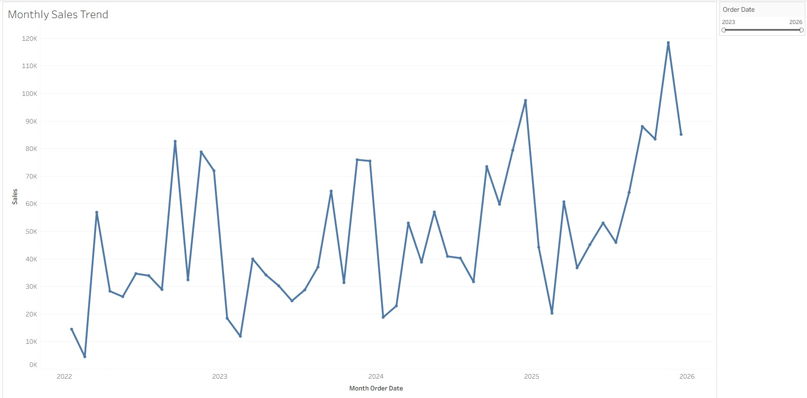
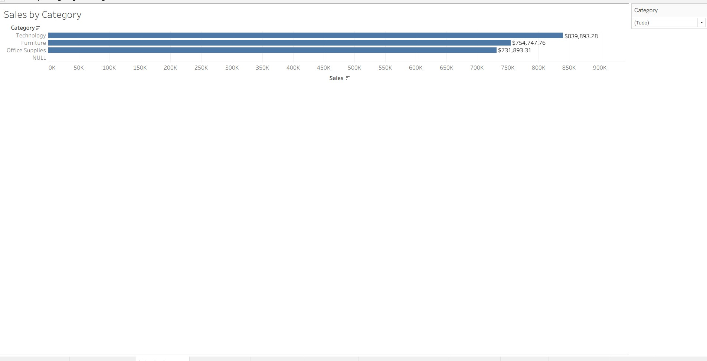
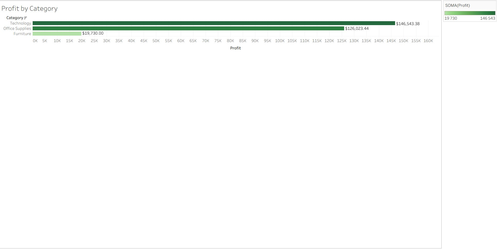
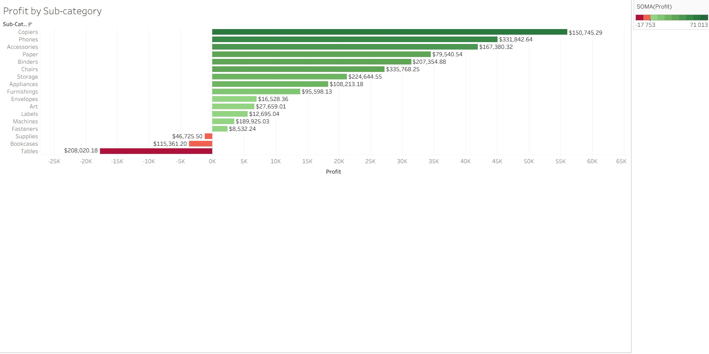
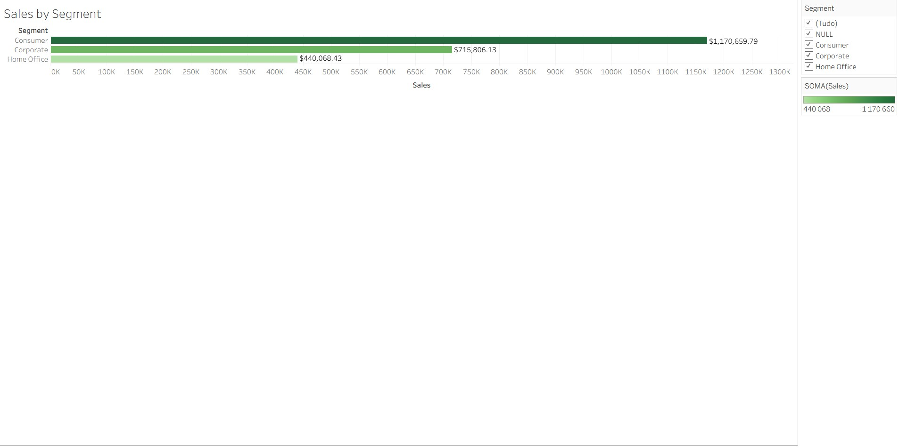
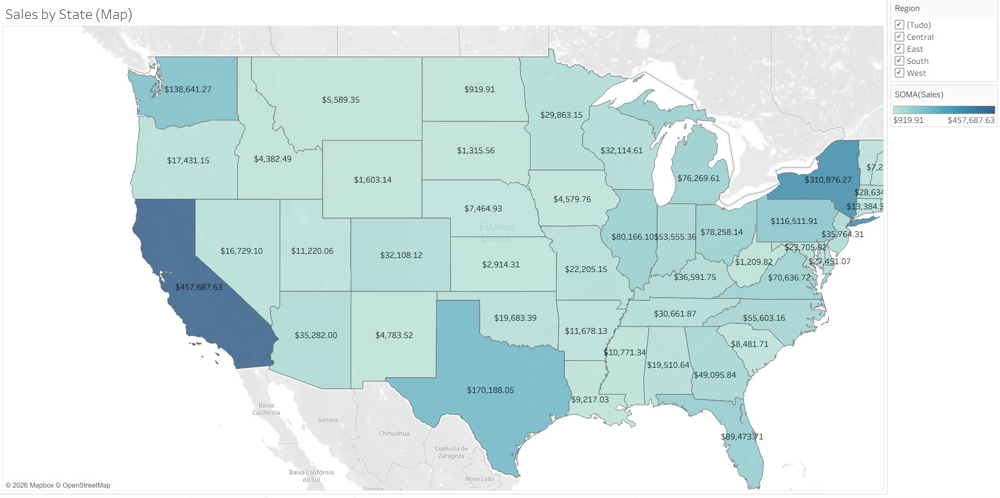

# Sales Performance & Profitability Analysis — Tableau

## 📊 Project Overview

This project analyzes retail sales performance using **Tableau**, with a focus on identifying sales trends, profitability drivers, customer segment performance, and geographic differences.

The dashboard was developed from a **Business Analyst perspective**, translating transactional data into business insights through KPIs, interactive visualizations, calculated fields, and recommendations.

---

## 🎯 Business Objective

The objective of this project is to analyze sales and profitability performance and answer key business questions:

- How are sales evolving over time?
- Which product categories generate the most sales and profit?
- Which sub-categories are the most and least profitable?
- Which customer segments contribute most to revenue?
- Where are sales geographically concentrated?
- Which areas of the portfolio are generating negative profit?
- Where are there opportunities to improve profitability?

---

## 🛠️ Tools & Technologies

- **Tableau** — Data visualization and interactive dashboard
- **Google Sheets** — Data preparation and organization
- **Calculated Fields** — Business metrics and analytical logic
- **GitHub** — Project documentation and portfolio

---

## 📁 Dataset

The dataset contains approximately **10,194 transactional records** and **20 columns**.

Key fields include:

- Order ID
- Order Date
- Ship Date
- Ship Mode
- Customer ID
- Customer Name
- Segment
- Country/Region
- City
- State/Province
- Postal Code
- Region
- Product ID
- Category
- Sub-Category
- Product Name
- Sales
- Quantity
- Discount
- Profit

### Data Period

**January 2023 – December 2026**

No blank values were identified in the main sales dataset, and all sales records contain positive sales values.

---

## 📌 Key KPIs

The dashboard provides an executive-level overview of sales and profitability performance.

| KPI | Result |
|---|---:|
| Total Sales | **€2.33M** |
| Total Profit | **€292.30K** |
| Total Orders | **5.11K** |
| YoY Sales Growth | **21.4%** |

---

# 📈 Dashboard Analysis

## 1. Monthly Sales Trend

The monthly sales trend tracks sales performance over time and helps identify:

- Growth trends
- Peaks and declines
- Seasonal patterns
- Changes in performance across years



---

## 2. Sales by Category

This analysis compares revenue generated by the main product categories.

Technology represents the largest sales category, followed by Furniture and Office Supplies.



---

## 3. Profit by Category

This view highlights the contribution of each product category to overall profitability.

Technology generates the highest profit contribution, followed by Office Supplies and Furniture.



---

## 4. Profit by Sub-Category

The sub-category analysis provides a more detailed view of profitability and highlights both high-performing and loss-making areas.

Several sub-categories generate strong positive profit, while others generate negative profit. These areas may require further investigation into pricing, discounts, product costs, or sales strategy.



---

## 5. Sales by Segment

This analysis compares sales performance across the main customer segments:

- Consumer
- Corporate
- Home Office

The Consumer segment represents the largest contribution to overall sales.



---

## 6. Geographic Sales Analysis

The geographic analysis shows the distribution of sales across U.S. states.

This visualization helps identify high-performing markets and geographic areas where additional commercial analysis may be valuable.

California represents one of the strongest markets in terms of sales.



---

# 🧮 Calculated Fields

Several calculated fields were created in Tableau to transform raw transactional data into business-oriented metrics.

### Profit Margin %

```text
IF SUM([Sales]) = 0 THEN 0
ELSE SUM([Profit]) / SUM([Sales])
END
```

### Other Calculated Fields

- **Profit Status** — Classifies profitability performance.
- **Average Order Value** — Measures the average revenue generated per order.
- **Discount Category** — Groups transactions according to discount levels.
- **Shipping Time (Days)** — Calculates the number of days between order and shipment.
- **Year-over-Year Sales Growth** — Measures sales growth compared with the previous year.

These calculations support profitability analysis, operational analysis, and performance tracking.

---

# 🔍 Key Insights

The analysis highlights several relevant business patterns:

### 1. Technology is the strongest category

Technology generates the highest sales and profit contribution among the main product categories, making it a key driver of overall business performance.

### 2. Consumer is the largest customer segment

The Consumer segment generates the highest sales contribution, followed by Corporate and Home Office.

### 3. Profitability varies significantly by sub-category

Profitability differs considerably across sub-categories.

Some areas generate strong positive profit, while others generate negative profit. This creates opportunities to investigate:

- Pricing strategy
- Discount levels
- Product costs
- Sales mix
- Operational costs

### 4. Sales performance shows an upward trend

The monthly sales trend shows stronger sales levels toward the later years of the analyzed period, with significant peaks during some months.

### 5. Geographic performance is concentrated

Sales are not evenly distributed across the U.S. market. Certain states contribute significantly more revenue than others, creating opportunities for regional performance analysis.

---

# 💡 Business Recommendations

Based on the analysis, several potential business actions can be considered:

1. **Prioritize high-performing categories and markets** when planning commercial strategies.

2. **Investigate loss-making sub-categories** to understand whether negative profitability is driven by discounts, pricing, product costs, or other operational factors.

3. **Review the relationship between discounts and profitability** to determine whether aggressive discounting is reducing margins.

4. **Analyze high-sales / low-profit products** to identify opportunities to improve margins without compromising revenue.

5. **Use geographic performance data** to support regional sales and marketing decisions.

6. **Monitor monthly sales trends** to identify seasonal patterns and improve sales planning and forecasting.

---

# 🎨 Dashboard Design

The dashboard was designed with a clean and business-oriented approach, prioritizing:

- Executive KPIs
- Clear visual hierarchy
- Interactive filters
- Consistent formatting
- Easy interpretation for non-technical stakeholders
- Business-focused storytelling

The objective was not only to visualize the data, but to make the analysis useful for **business decision-making**.

---

# 🚀 Skills Demonstrated

This project demonstrates practical skills in:

- Business Analysis
- Data Visualization
- Tableau
- KPI Development
- Data Exploration
- Profitability Analysis
- Sales Performance Analysis
- Geographic Analysis
- Business Storytelling
- Calculated Fields
- Data-Driven Decision Making
- Translating data into business recommendations

---

# 📂 Repository Structure

```text
sales-performance-tableau-dashboard/
│
├── README.md
│
├── Monthly_sales.jpg
├── Profti_sub_category.jpg
├── profit_by_category.jpg
├── sales_by_category.jpg
├── sales_by_segment.jpg
└── sales_by_state.jpg
```

---

# 👤 Author

**Luis Silva**

Aspiring **Business Analyst / Data Analyst** focused on using data to support business decisions.
